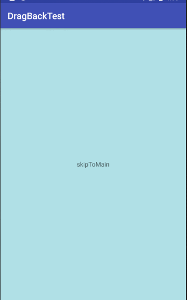

[实现Activity的滑动返回效果 \- CSDN博客](https://blog.csdn.net/eiuly/article/details/46472783)


# activity 侧滑关闭辅助类

### 示例

```
public class Main2Activity extends AppCompatActivity {

      private static final String TAG = "Main2Activity";
      private SwipeDismiss mSwipeDismiss;

      public static void start (Context context) {

            Intent starter = new Intent(context, Main2Activity.class);
            context.startActivity(starter);
      }

      @Override
      protected void onCreate (Bundle savedInstanceState) {

            super.onCreate(savedInstanceState);
            setContentView(R.layout.activity_main2);

            /* 创建工具 */
            mSwipeDismiss = new SwipeDismiss(this);
            /* 设置触发点,小于该触发点才会侧滑 */
            mSwipeDismiss.setCouldSwipeX(200);
      }

      @Override
      public boolean onTouchEvent (MotionEvent event) {

            /* 传递给工具触摸事件 */
            mSwipeDismiss.onActivityTouchEvent(event);
            return true;
      }
}
```




## 引入

```
implementation 'tech.threekilogram:swipeback:2.0.0'
```


